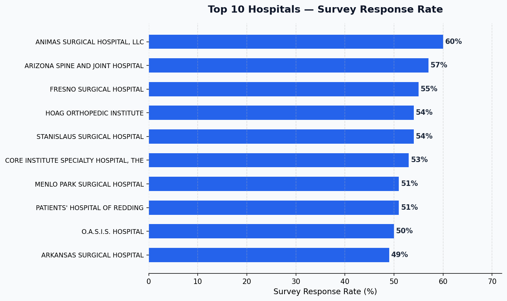
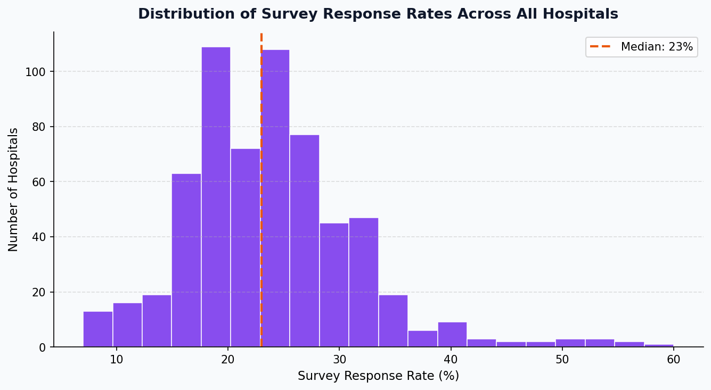
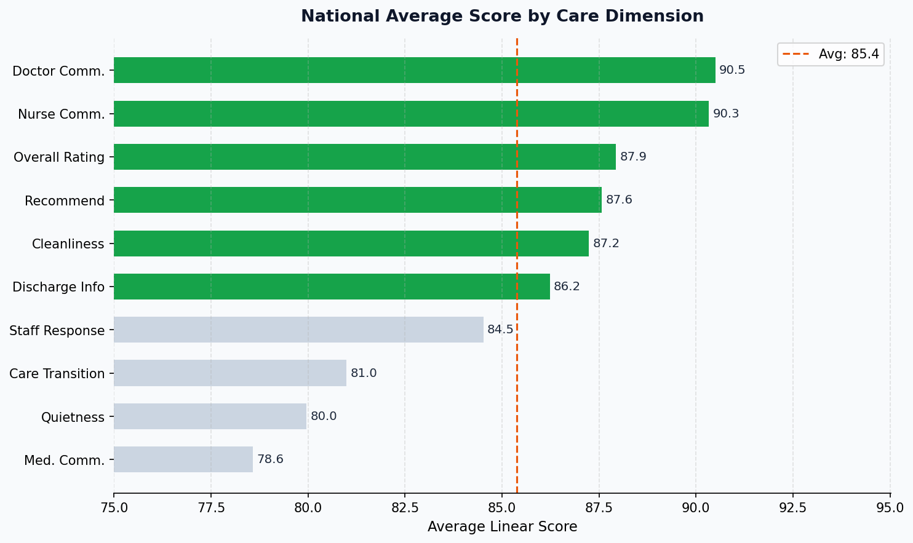
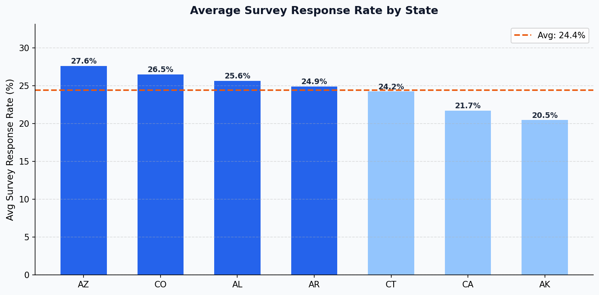

# Healthcare Patient Survey Analysis

An interactive Streamlit dashboard that explores HCAHPS (Hospital Consumer Assessment of Healthcare Providers and Systems) patient survey data across **619 hospitals** and **7 states**. The app surfaces care quality trends, response rate patterns, and hospital benchmarks through a series of filterable, drill-down charts.

---

## Features

| Section | What it shows |
|---|---|
| **Dataset Overview** | KPI metrics — total surveys, hospitals, best response rate, top city & state |
| **Surveys by Hospital** | Completed survey counts per hospital, switchable Bar / Line / Scatter |
| **Response Rate by Measure** | Strip plot of response rate distribution across all HCAHPS measure IDs |
| **Top 3 Counties** | Counties with the highest average survey response rate |
| **Top 10 Hospitals** | Hospitals ranked by average survey response rate |
| **County & City Drill-down** | Treemap + bar chart — drill from state → county → city → hospital star rating |
| **Hospitals in Same City** | Cities sharing multiple hospitals, with contact detail lookup |
| **All Hospitals — Response Rate** | Every hospital's response rate with histogram, ranked bar, and full table |

---

## Tech Stack

- **Python 3.14**
- **Streamlit** — interactive web app
- **Pandas** — data wrangling
- **Plotly Express / Graph Objects** — interactive charts
- **NumPy** — numerical operations

---

## Project Structure

```
healthcare-patient-survey-analysis/
├── analysis.py                          # Main Streamlit app
├── data/
│   └── Health Care_Patient_survey_source.csv
├── screenshots/                         # Chart previews
└── README.md
```

---

## Getting Started

### 1. Clone the repo

```bash
git clone <repo-url>
cd healthcare-patient-survey-analysis
```

### 2. Create and activate a virtual environment

```bash
python3 -m venv .venv
source .venv/bin/activate        # macOS / Linux
.venv\Scripts\activate           # Windows
```

### 3. Install dependencies

```bash
pip install streamlit pandas plotly numpy
```

### 4. Run the app

```bash
streamlit run analysis.py
```

The app opens at **http://localhost:8501** in your browser.

---

## Data

The source file (`data/Health Care_Patient_survey_source.csv`) contains HCAHPS survey responses with the following key fields:

| Field | Description |
|---|---|
| `Provider ID` / `Hospital Name` | Hospital identifier |
| `Measure ID` / `Question` | Survey dimension (e.g. nurse communication, cleanliness) |
| `Answer Percent` | % of patients giving a particular answer |
| `Linear Mean Value` | Continuous score (0–100) for the measure |
| `Patient Survey Star Rating` | 1–5 star rating per dimension |
| `Survey Response Rate Percent` | % of eligible patients who returned the survey |
| `Number of Completed Surveys` | Raw survey count |

**Coverage:** 619 hospitals · 7 states (AK, AL, AR, AZ, CA, CO, CT) · ~35,000 rows

---

## Dashboard Preview

### Top 10 Hospitals by Survey Response Rate

> Animas Surgical Hospital leads with a **60% response rate** — more than 2.5× the national average of 23.8%.



---

### Distribution of Response Rates Across All Hospitals

> Most hospitals cluster between **15–30%**, with a long right tail of high-engagement outliers.



---

### National Average Score by Care Dimension

> **Discharge Information** and **Nurse Communication** score highest nationally. **Staff Responsiveness** and **Quietness** are the most common areas for improvement.



---

### Average Survey Response Rate by State

> **AK (Alaska)** leads all states in average response rate. **CA (California)**, with the largest number of hospitals in the dataset, sits below the national average.



---

## Key Insights

- **Response rates are low overall** — the national median is ~22%, meaning most hospitals hear back from fewer than 1 in 4 eligible patients.
- **Specialty / surgical hospitals dominate the top response rates** — smaller patient volumes make follow-up easier.
- **Nurse communication is the strongest predictor of overall hospital rating** (r = 0.88) and patient recommendation (r = 0.84).
- **Care transition** is the second-strongest driver of patient recommendation, suggesting that post-discharge support matters as much as in-hospital care.
- **Quietness** is the most independent dimension — hospitals that score well on other dimensions don't necessarily score well on quietness.
